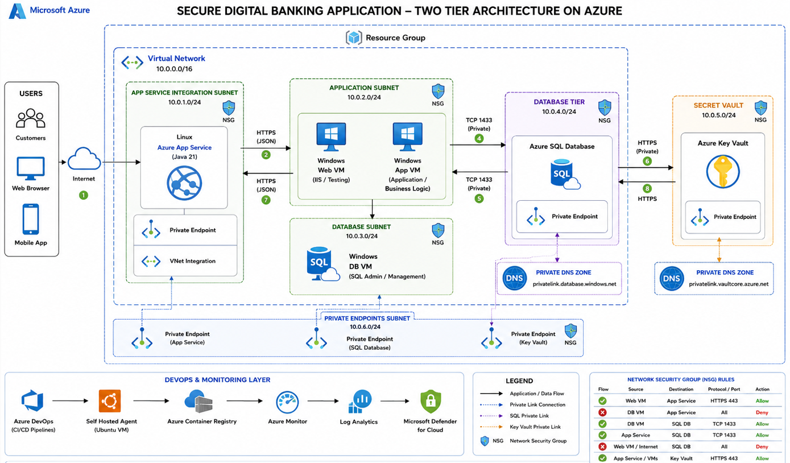

# SecureBank – Secure Digital Banking Application

SecureBank is a two-tier digital banking project built using Java 21 and Spring Boot. The application is designed for secure deployment on Microsoft Azure using private networking and an Azure DevOps CI/CD pipeline.

## Project Objective

Deploy a secure digital banking application on Azure with controlled network access, private endpoints, managed identity, Azure Key Vault, Azure SQL Database, monitoring and automated deployment.

## Technologies

- Java 21
- Spring Boot
- Maven
- HTML5
- CSS3
- JavaScript
- Git and GitHub
- Microsoft Azure
- Azure DevOps
## Application Features

## Architecture

The following diagram shows the secure two-tier Azure architecture designed for this application.


## Application Features

- Responsive banking homepage
- Customer login demonstration
- Customer account dashboard
- Account balance cards
- Recent transaction history
- Money-transfer review form
- Spring Boot REST API
- Maven build and packaging

## API Endpoints


### Application status

```text
GET /api/status
```

### Customer accounts

```text
GET /api/accounts
```